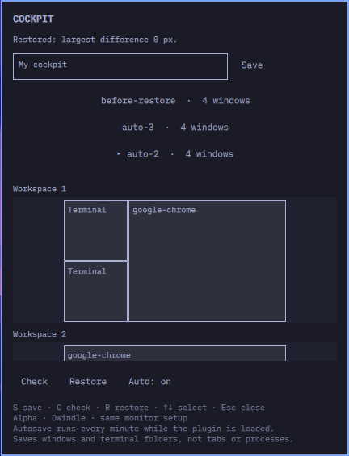

# Omarchy Cockpit

Save your window arrangement, preview it in the Omarchy bar, and restore it later.
Cockpit reconstructs Dwindle splits and measures the resulting window geometry.

**Experimental alpha — `0.1.0-alpha.2`.** Tested on Omarchy Quattro with Hyprland
0.56.2, Lua configuration, and one monitor. A complete reboot has not been tested;
the live test closes disposable terminals and restores them as new processes from disk.
The interface and backend messages default to English. [Dansk vejledning](README.da.md).



## Install

Requires Omarchy Quattro's plugin-capable Quickshell, Hyprland 0.56.2's Lua dispatcher
API, Python 3.10+, and `dwindle:preserve_split` enabled. Foot is required to reopen
Foot terminals; Chrome/Chromium is only needed to reopen its respective windows.
No pip packages, downloaded runtime dependencies, root access, or network service.

```bash
omarchy plugin add https://github.com/Danubii/omarchy-cockpit --enable
```

Click **▦ Cockpit** in the bar. The panel reports loading, checks, restores, and
errors in its status line; hover a control for a short description. If needed,
place the widget explicitly:

```bash
omarchy plugin enable zeq0r.cockpit --section left
omarchy-shell shell summon zeq0r.cockpit '{}'
```

The plugin runs inside the existing Omarchy shell. A short-lived local Python process
handles save/restore operations. Snapshots stay on your computer.

## Use

| Control | Action |
| --- | --- |
| **Save** / **S** | Save under a name; Enter saves while editing the name |
| Saved-layout list / **↑↓** | Select a layout and preview its workspaces |
| **Check** / **C** | Check restoration prerequisites without moving windows |
| **Restore** / **R** / **Enter** | Restore the selected snapshot |
| **Auto** / **A** | Toggle one-minute autosave into ten rotating snapshots |
| **Esc** | Leave name editing, then close the panel |

Controls expose descriptive names to accessibility tools. The selected layout and
autosave state remain visibly highlighted. Long lists and previews scroll with the
pointer or touchpad.

Named snapshots survive a restart. **Restoring after login is manual.** Autosave
only runs while the widget is loaded, defaults to off, and resets on shell restart.
Saving an existing name replaces that snapshot. Empty sessions do not replace saves.

Restore reports the largest measured pixel difference. Success means every window
is within 2 pixels and has the expected workspace and floating state. The four
tested live scenarios each measured **0 pixels**; this is not a guarantee for other layouts.

## What is restored

- Dwindle split structure, window sizes, regular and special workspaces, and monitor assignments.
- Floating window positions and sizes.
- Foot windows in their shell's working directory, with a unique restore app ID.
- A new Chrome/Chromium window when a matching window is missing.
- Already-open windows from other apps, when they can be identified unambiguously.

**App content is not saved:** terminal commands, scrollback, shell state, browser
tabs, browser profiles, and editor documents require app-specific session support.
This is window-layout persistence, not process checkpointing.

The alpha requires the same monitor names, resolution, scale, rotation, and reserved
panel space. Global monitor positions may change. Multi-monitor support has not
been live-tested. Fullscreen, grouped, and pinned windows are rejected before
restoration. Extra windows on target workspaces are also rejected. Duplicate app
classes are matched by title, workspace, and geometry. Window rules, minimum sizes, or changing focus during restoration
can prevent an exact result.

Restore never closes existing windows. Before modifying a nonempty session it saves
`before-restore`. A failure after launching or moving windows can leave a partial
result; there is no automatic rollback. To use `before-restore`, first move any
newly opened extra windows out of its target workspaces.

## Files and command line

Snapshots: `~/.local/share/omarchy-cockpit/*.json`, written with private file permissions.
They contain window titles, application names, geometry, and terminal working directories.
`last-restore-report.json` contains the measured restore result. Do not publish personal snapshots.

The marketplace installation exposes the backend directly:

```bash
python3 ~/.config/omarchy/plugins/zeq0r.cockpit/cockpit.py save "Work"
python3 ~/.config/omarchy/plugins/zeq0r.cockpit/cockpit.py restore "Work" --dry-run
python3 ~/.config/omarchy/plugins/zeq0r.cockpit/cockpit.py restore "Work"
python3 ~/.config/omarchy/plugins/zeq0r.cockpit/cockpit.py show "Work"
```

Set a launch recipe for an unsupported app using the slot shown by `show`:

```bash
python3 ~/.config/omarchy/plugins/zeq0r.cockpit/cockpit.py recipe "Work" SLOT -- program argument
```

Arguments are passed directly without a shell. The program must create a window
with the snapshot's `restore_class`. Recipes are executable instructions: only use
snapshots and commands you trust. Arbitrary `/proc` command lines are not replayed.

## Update and remove

```bash
omarchy plugin update zeq0r.cockpit
omarchy restart shell

# Disable, or remove the plugin:
omarchy plugin disable zeq0r.cockpit
omarchy plugin remove zeq0r.cockpit
```

Snapshots are retained when removing the plugin. Delete the
`~/.local/share/omarchy-cockpit/` directory separately only if you no longer want them.
If you used the optional local installer, also delete its launcher at
`~/.local/bin/omarchy-cockpit`. Standard marketplace installation does not create that launcher.

## Development

`bash install.sh` is an optional local development installer. It copies the runtime
files, creates the `omarchy-cockpit` launcher, backs up `shell.json`, enables the widget,
and restarts the shell to clear cached QML. It does not edit Hyprland configuration.
Standard installation through `omarchy plugin add` does not execute this script.

```bash
python3 -m unittest -v test_cockpit.py
bash check.sh                  # requires installed Omarchy and Qt's qmllint
python3 live_test.py           # opt-in: opens and closes disposable Foot windows
```

Validation on 2026-09-05: 10 unit tests passed; the manifest validated; QML structural
lint passed with documented exclusions for dynamic Quickshell types. Four live tests
passed at 0 px: scrambled existing windows, newly launched processes, four tiled
windows with unequal splits, and mixed floating/tiled windows. Keyboard save/check,
panel open/close, and shell restart were also tested.

## References and license

MIT; see [LICENSE](LICENSE). The panel follows the
[Omarchy plugin development guide](https://plugins.omarchy.org/develop.html) and uses
Omarchy's installed `qs.Ui` components. The backend uses the
[Hyprland Lua dispatchers](https://wiki.hypr.land/Configuring/Basics/Dispatchers/).
[hypr-persist](https://github.com/ngamber/hypr-persist) was investigated as a technical
reference; this plugin uses its own Python backend and does not depend on that project.
